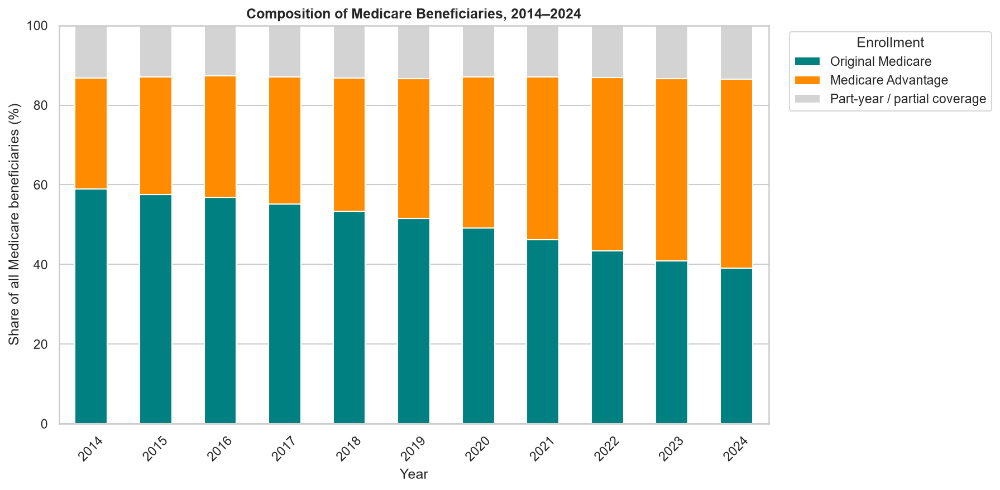
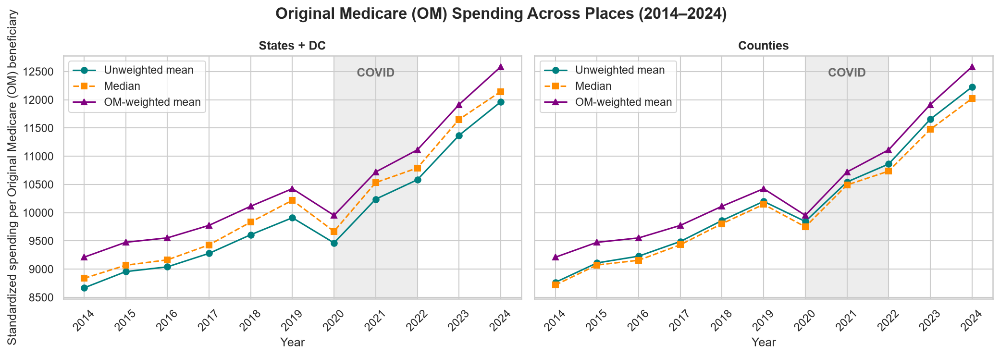
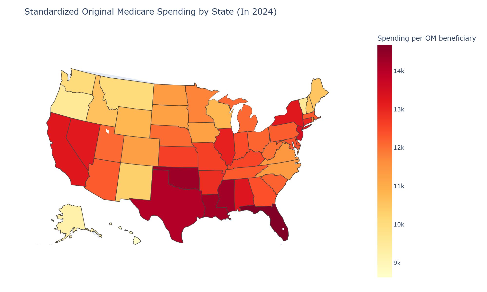
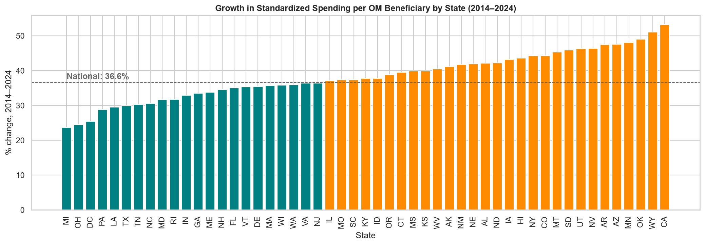
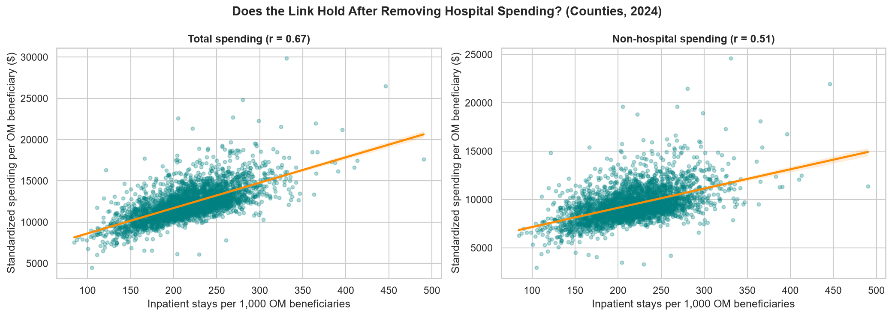
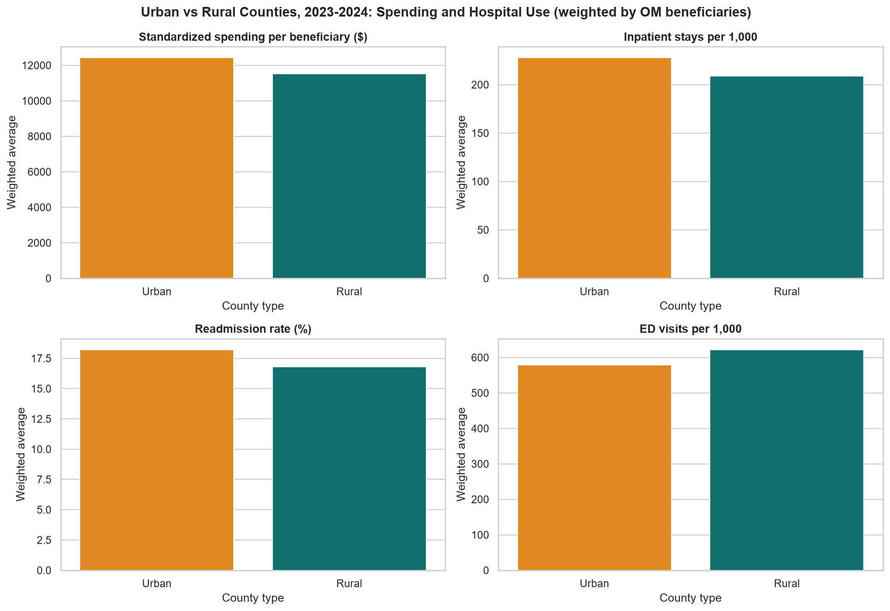

# Introduction and research question

Medicare spending per beneficiary has long varied across the United States. Dartmouth Atlas researchers found that patients in higher-spending regions were hospitalized more often without receiving better care,[^dartmouth] and an Institute of Medicine committee advised targeting provider decisions rather than geography.[^iom]

Our research question is: how did Medicare spending per beneficiary change across U.S. states from 2014 to 2024, and do places that spend more also use more hospital care? As an extension, we ask whether rural and urban counties differ.

# Data

We use the CMS Medicare Geographic Variation file (national, state and county, 2014–2024).[^cms] The raw file has 36,994 rows; after cleaning, we analyze 50 states plus DC (561 state-year rows) and 35,102 county-year rows. Counties were joined to the USDA Rural-Urban Continuum Codes 2023 by FIPS code.[^usda] Of 621 county rows without a code, 550 are CMS "-UNKNOWN" placeholders; the rest are former Connecticut counties and renamed Alaska and South Dakota counties.

All measures describe Original Medicare (fee-for-service) beneficiaries only,[^dict] a shrinking group: its share of all beneficiaries fell from about 59% in 2014 to 39% in 2024, while Medicare Advantage rose from 28% to 47% (@fig-enrollment).

{#fig-enrollment}

# Methods

Spending is CMS standardized spending per Original Medicare beneficiary, which removes geographic differences in payment rates. Dollars are nominal, so we compare places within years and state growth against national growth. We kept "All ages" rows, dropped Puerto Rico, the Virgin Islands and the CMS "Territory" and "ZZ" placeholders, and left CMS-suppressed values ("\*") missing rather than imputing them.

Averages are weighted by Original Medicare beneficiaries (readmission rates by estimated hospital stays). We measure association with Pearson correlation, using Spearman rank correlation as a robustness check.[^pandas] We also compute non-hospital spending: total minus inpatient standardized spending. Counties with codes 1–3 are urban and 4–9 rural; 2023 codes are applied to all years.

# Findings

## Spending trends across states

**Spending rose everywhere, but unevenly.** National standardized spending per beneficiary grew from \$9,191 in 2014 to \$12,553 in 2024 (+36.6%), dipping in 2020 during the COVID-19 pandemic (@fig-trend).

{#fig-trend}

**High spending clusters in the South** (@fig-map). Louisiana spent the most from 2014 to 2023 and Florida in 2024 (\$14,680); Hawaii spent the least every year (\$8,622 in 2024).

{#fig-map}

**Lower-spending states grew faster.** Growth ranged from 23.7% in Michigan to 53.2% in California (@fig-growth), and 2014 spending was negatively correlated with growth (r = −0.46). The gap between the highest and lowest state widened from \$4,992 to \$6,058, but the coefficient of variation fell from 0.13 to 0.11: states became slightly more similar relative to the average.

{#fig-growth}

## Spending and hospital use

**Places that spend more also use more inpatient care.** Across 3,130 counties in 2024, spending is associated with inpatient stays per 1,000 beneficiaries (r = 0.67), more strongly than with ED visits (r = 0.39) or readmission rates (r = 0.32).

**The link holds after removing hospital spending.** Because total spending includes inpatient spending, part of this correlation is automatic. Non-hospital spending still correlates with inpatient stays (@fig-nonip, @tbl-corr): r = 0.51 for counties (from 0.67) and 0.69 for states (from 0.81). Spearman coefficients are similar, so outliers do not drive the result.

{#fig-nonip}

| Level    |     n | Pearson: total | Pearson: non-hospital | Spearman: total | Spearman: non-hospital |
|:---------|------:|---------------:|----------------------:|----------------:|-----------------------:|
| States   |    51 |           0.81 |                  0.69 |            0.78 |                   0.65 |
| Counties | 3,130 |           0.67 |                  0.51 |            0.67 |                   0.51 |

: Correlation of 2024 standardized spending per Original Medicare beneficiary with inpatient stays per 1,000 beneficiaries, using total and non-hospital spending. {#tbl-corr}

**Higher spending does not come with fewer readmissions.** The positive readmission correlation is consistent with the Dartmouth finding that higher-spending regions do not deliver better care.

## Rural vs urban counties

**Urban counties spend more and use more inpatient care; rural counties use the ED more.** In 2023–2024, weighted spending per beneficiary was \$12,433 in urban and \$11,519 in rural counties (@fig-rural). Urban counties had more inpatient stays (228 vs 209 per 1,000) and higher readmission rates (18.2% vs 16.8%); rural counties had more ED visits (622 vs 579 per 1,000).

{#fig-rural}

**Weighting reveals the spending gap.** Unweighted averages look nearly equal (\$11,958 vs \$11,930) because each small rural county counts as much as a large metro county. The pattern also held in 2014–2019 (spending \$9,897 vs \$9,251; ED visits 662 vs 725). Urban counties spent more within low, middle and high Medicaid-share groups (+\$1,119, +\$498, +\$1,197), so Medicaid mix does not appear to explain the gap.

# Recommendations

1. **Look beyond the hospital.** Because non-hospital spending also tracks inpatient use, reviews of high-spending areas should cover care outside the hospital, not only admissions.
2. **Measure need first.** CMS should restore a risk score to the public file; meanwhile, as the IOM advised, policy should target provider decisions rather than whole regions.
3. **Study rural ED use.** Higher ED use despite fewer admissions warrants research into rural primary-care access.

# Limitations

The data cover Original Medicare only, a shrinking share of beneficiaries (@fig-enrollment). We could not adjust for health risk: the average HCC risk score in earlier releases [VERIFY: 2014–2022 or 2014–2023 release] is absent from the 2014–2024 file, and Medicaid share is only a rough proxy. Correlation is not causation, and place-level results do not describe individual patients (the ecological fallacy). Dollars are nominal, 2023 rural-urban codes are applied to all years, and suppressed values are concentrated in small, mostly rural counties.

# Reproducibility

Code and data are available at [REPO URL]. Running `notebooks/01_cleaning.ipynb` and then `notebooks/02_analysis.ipynb` recreates the cleaned files in `data/clean/` and every figure in `report/figures/`.

# Appendix: moving-average forecast

Over 2017–2024, a 2-year moving average forecast national spending more accurately than a 3-year average (MAD \$608.81 vs \$697.17; MAPE 5.46% vs 6.21%). Both underestimated 2023–2024 by about \$1,000 or more, suggesting faster post-pandemic growth; the 2-year method forecasts about \$12,220 for 2025.

[^cms]: Centers for Medicare & Medicaid Services (CMS). *Medicare Geographic Variation – by National, State & County* (2014–2024 public use file). data.cms.gov; listed on data.gov as issued December 9, 2025 and last modified May 15, 2026. Accessed [VERIFY: download date]. <https://data.cms.gov/summary-statistics-on-use-and-payments/medicare-geographic-comparisons/medicare-geographic-variation-by-national-state-county>

[^dict]: Centers for Medicare & Medicaid Services (CMS). *2014–2024 Original Medicare Geographic Variation by National, State & County Data Dictionary*. data.cms.gov, 2026 [VERIFY: the PDF is undated]. Its notes define Original Medicare as "the traditional Medicare Fee-for-Service (FFS) program covering Part A and Part B" and state that all variables are suppressed (marked "\*") where the count of beneficiaries or users is less than 11. <https://data.cms.gov/sites/default/files/2026-05/267755af-8e26-4bcd-a3ea-fef41c96b7fc/2014-2024%20Original%20Medicare%20Geographic%20Variation%20Data%20Dictionary.pdf>

[^usda]: U.S. Department of Agriculture, Economic Research Service (USDA ERS). *Rural-Urban Continuum Codes, 2023*. Released January 2024. Codes 1–3 classify metropolitan counties by metro-area population; codes 4–9 classify nonmetropolitan counties by urban population and adjacency to a metro area. <https://www.ers.usda.gov/data-products/rural-urban-continuum-codes>

[^pandas]: The pandas development team. "pandas.Series.corr." *pandas documentation* (pandas 3.0). Pearson ("standard correlation coefficient") and Spearman ("Spearman rank correlation") coefficients were computed with this method. <https://pandas.pydata.org/docs/reference/api/pandas.Series.corr.html>

[^dartmouth]: Fisher ES, Goodman DC, Skinner J, Bronner K. *Health Care Spending, Quality, and Outcomes: More Isn't Always Better*. A Dartmouth Atlas Project Topic Brief. The Dartmouth Institute for Health Policy and Clinical Practice; February 27, 2009. <https://data.dartmouthatlas.org/downloads/reports/Spending_Brief_022709.pdf>. See also The Dartmouth Atlas of Health Care, <https://www.dartmouthatlas.org/>.

[^iom]: Institute of Medicine. *Variation in Health Care Spending: Target Decision Making, Not Geography*. Newhouse JP, Garber AM, Graham RP, McCoy MA, Mancher M, Kibria A, editors. Washington, DC: The National Academies Press; 2013. <https://doi.org/10.17226/18393>
